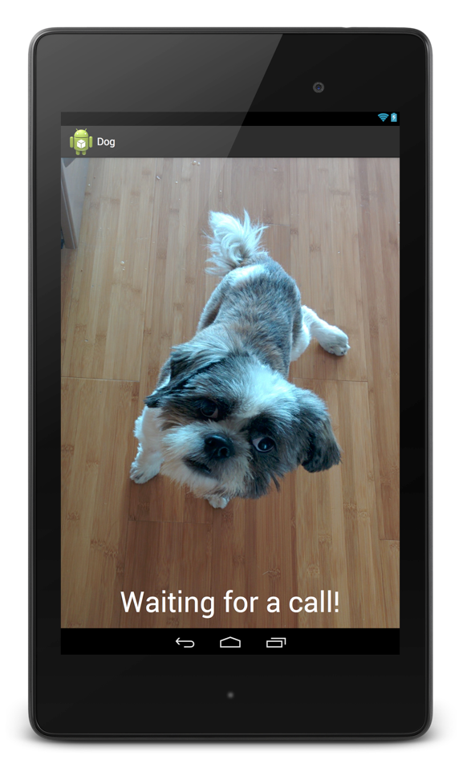

#Talk to Your Pet While You're at Work

Want to check in on your pet while you're at work, but not willing to shell out the big bucks for custom hardware devices like [PetChatz](http://www.petchatz.com/) and [PetCube](https://petcube.com/)? If you have an Android tablet and phone, you can build a voice communication system to chat with your pet in no time at all!

You can find the finished code for this tutorial [on our Github]().

##Sinch Setup

You will use the Sinch Android SDK for the voice stream in this app. First, download the SDK from [here](http://www.sinch.com/downloads). Next, [sign up for a developer account](http://www.sinch.com/dashboard/#/signup), and create an app in the developer console. In a few minutes, you will need the app key and secret that were generated for you. Then, create a new Android project (I'm using Android Studio, but Eclipse will work too). Follow these steps to add Sinch as a library:

**Android Studio**    
1. Copy the two jar files into your project's libs folder    
2. Right click the jar files and select "Add as library"    
3. Create a new folder under src/main, and name it jniLibs    
4. Move the armeabi and armeabi-v7a folders into the jniLibs folder you just created    

**Eclipse**    
Copy the entire libs folder into your project's root directory.

##Build the Pet's App

For the pet's app, you really only need a blank screen that automatically accepts incoming phone calls. I jazzed mine up a little bit:

In your main activity, all you need to do is start an instance of the Sinch Client, listen for incoming calls, and automatically answer incoming calls. First, start the client using the app key and secret you generated earlier:

    sinchClient = Sinch.getSinchClientBuilder()
        .context(this)
        .userId("dog")
        .applicationKey("key")
        .applicationSecret("secret")
        .environmentHost("sandbox.sinch.com")
        .build();

    sinchClient.setSupportCalling(true);
    sinchClient.startListeningOnActiveConnection();
    sinchClient.start();
    
Next, define a custom call listener that will automatically answer incoming calls:

    private class SinchCallClientListener implements CallClientListener {
        @Override
        public void onIncomingCall(CallClient callClient, Call incomingCall) {
            incomingCall.answer();
        }
    }
    
After starting the Sinch Client, add an instance of `SinchCallClientListener`:

    sinchClient.getCallClient().addCallClientListener(new SinchCallClientListener());

In addition, stop listening for incoming calls and terminate the client when the app is killed:

    @Override
    protected void onDestroy() {
        super.onDestroy();
        sinchClient.stopListeningOnActiveConnection();
        sinchClient.terminate();
    }
    
Last but not least, you don't want the tablet to fall asleep from inactivity during the day. Add this line before starting the Sinch Client to keep the screen awake for as long as the app is open (let's hope your pet isn't smart enough to close the app!):

    getWindow().addFlags(WindowManager.LayoutParams.FLAG_KEEP_SCREEN_ON);
    
##The Human App

Lucky you - you don't need to build an app for yourself! In the Sinch Android SDK, there is a sample calling app that you can use to call your pet. Open **sinch-rtc-sample-calling** and enter the same key and secret from above in **SinchClientService.java**.

Now, run this app on your phone, and run the dog app on your tablet. The human app will prompt you for your name; you can enter anything here. To place the call, enter "dog" as the recipient name and press "call." You'll notice on your phone screen that the status of the call goes from "initiating" to "established" in 1-2 seconds without doing anything on the tablet.

So, tomorrow when you leave for work, open this app on your tablet, and leave it with the volume turned up and the app open. Call throughout the day to say hi, see if your dog is barking at the neighbors, or try to talk to your parrot!
